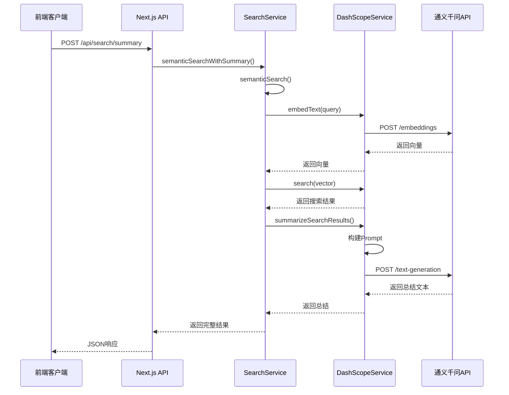
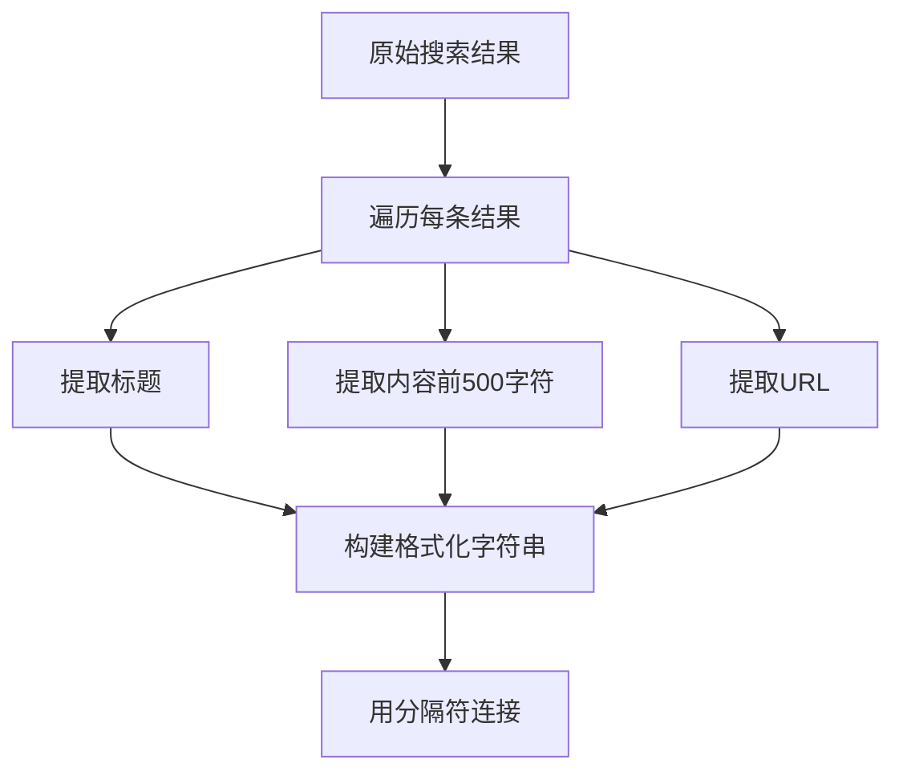
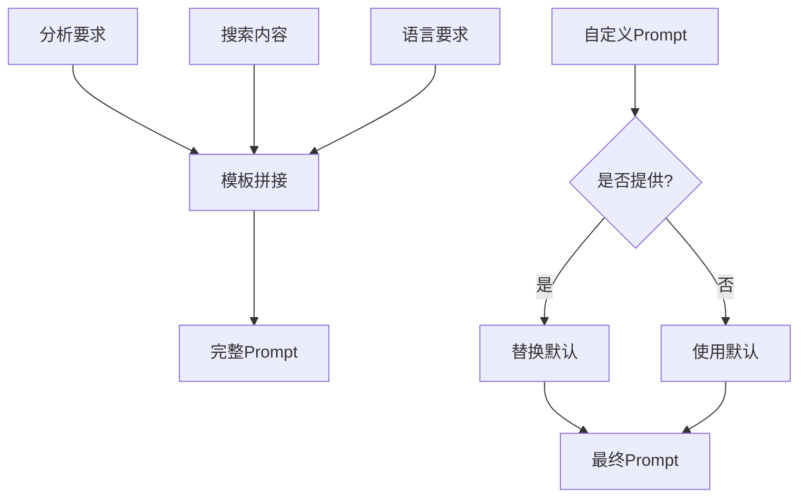
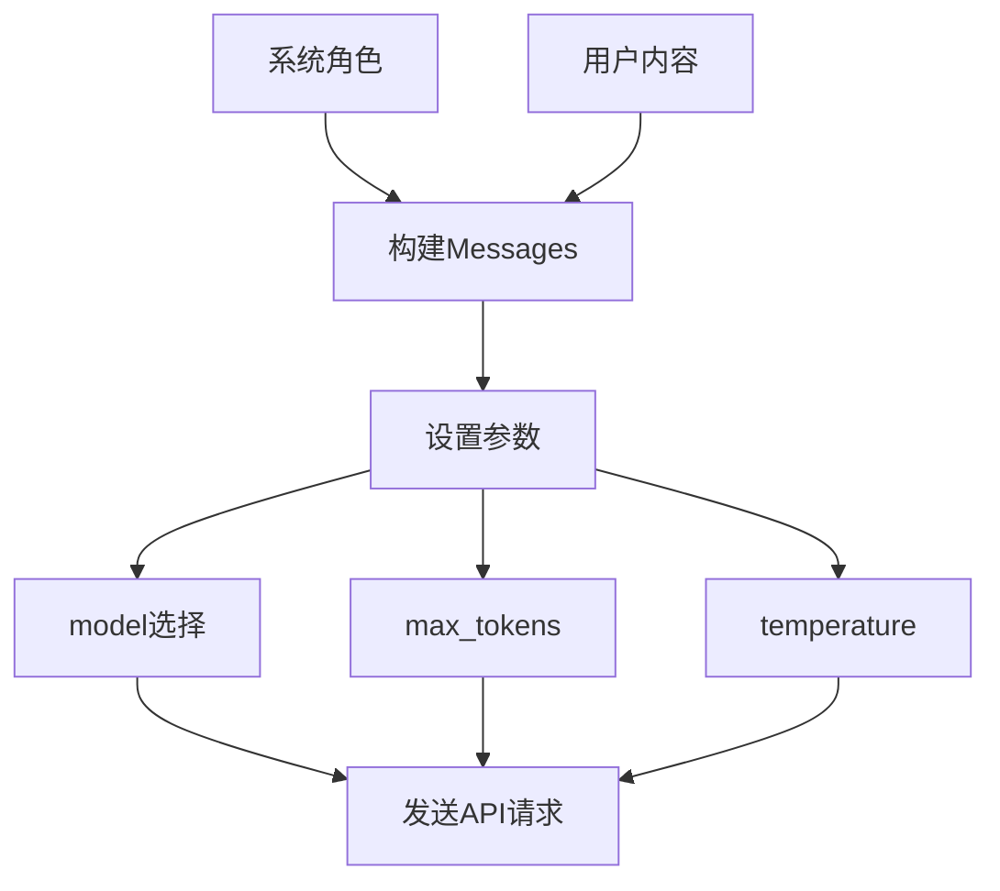

# AI 总结 Prompt 构建与处理流程图

## 🎯 AI 总结详细流程

```mermaid
flowchart TD
    %% 输入阶段
    A[搜索结果数组] --> B[提取结果数据]
    B --> C{遍历每个结果}

    C --> D[获取标题title]
    D --> E[获取内容content]
    E --> F[截取前500字符]
    F --> G[获取URL链接]
    G --> H[构建单条格式]

    H --> I[格式化模板]
    I --> J["【N】标题：{title}<br>内容：{content}...<br>链接：{url}"]

    %% 聚合阶段
    J --> K{还有更多结果?}
    K -->|是| C
    K -->|否| L[用分隔符连接]
    L --> M["---"]

    %% Prompt构建阶段
    M --> N[构建默认Prompt模板]
    N --> O[添加分析要求]
    O --> P[插入搜索结果内容]
    P --> Q[添加语言要求]

    Q --> R{有自定义Prompt?}
    R -->|是| S[使用自定义Prompt]
    R -->|否| T[使用默认Prompt]

    %% Messages构建阶段
    T --> U[构建System Message]
    U --> V["role: 'system'<br>content: '你是一个专业的内容分析助手...'"]

    S --> U
    V --> W[构建User Message]
    W --> X["role: 'user'<br>content: {最终Prompt}"]

    %% API调用阶段
    X --> Y[构建API请求参数]
    Y --> Z[设置模型参数]
    Z --> AA["model: 'qwen-turbo'<br>max_tokens: 2000<br>temperature: 0.3"]

    AA --> BB[调用DashScope API]
    BB --> CC["POST /api/v1/services/aigc/text-generation/generation"]

    CC --> DD[发送Messages数组]
    DD --> EE[等待AI处理]

    EE --> FF[接收API响应]
    FF --> GG[解析响应数据]
    GG --> HH[提取生成文本]
    HH --> II["response.output.text"]

    II --> JJ{响应有效?}
    JJ -->|是| KK[返回总结结果]
    JJ -->|否| LL[抛出错误]

    %% 样式定义
    classDef input fill:#e3f2fd,stroke:#1976d2,stroke-width:2px
    classDef process fill:#f3e5f5,stroke:#7b1fa2,stroke-width:2px
    classDef decision fill:#fff3e0,stroke:#f57c00,stroke-width:2px
    classDef api fill:#e8f5e8,stroke:#388e3c,stroke-width:2px
    classDef output fill:#fce4ec,stroke:#c2185b,stroke-width:2px

    class A,B,C,D,E,F,G input
    class H,I,J,K,L,M,N,O,P,Q process
    class R decision
    class S,T,U,V,W,X,Y,Z,AA,BB,CC,DD,EE,FF,GG,HH,II api
    class JJ,LL decision
    class KK output
```



## 📋 Prompt 构建核心逻辑

### 1. 搜索结果格式化

**输入数据结构**：

```typescript
interface SearchResult {
  title: string;
  content: string;
  url: string;
}
```

**单条结果格式化**：

```javascript
const formattedResult = `【${index + 1}】标题：${result.title}
内容：${result.content.substring(0, 500)}${
  result.content.length > 500 ? '...' : ''
}
链接：${result.url}
`;
```

**多条结果聚合**：

```javascript
const searchContent = results.map(formatSingleResult).join('\n---\n\n');
```

### 2. 默认 Prompt 模板

```javascript
const defaultPrompt = `请基于以下搜索结果进行分析和总结：

要求：
1. 提炼出主要主题和核心观点
2. 总结关键信息和要点
3. 识别共同的趋势或模式
4. 提供简洁的概括性结论
5. 如果有URL链接，请保留重要的链接信息

搜索结果：
${searchContent}

请用中文进行总结和分析。`;
```

### 3. Messages 构建

```javascript
const messages = [
  {
    role: 'system',
    content:
      '你是一个专业的内容分析助手，擅长对搜索结果进行总结和归纳。请提供清晰、准确、有价值的分析。',
  },
  {
    role: 'user',
    content: finalPrompt, // 默认或自定义prompt
  },
];
```

### 4. API 请求参数

```javascript
const requestData = {
  model: 'qwen-turbo',
  input: {
    messages: messages,
  },
  parameters: {
    max_tokens: 2000,
    temperature: 0.3,
    top_p: 0.8,
  },
};
```

## 🔄 API 调用时序图



## 📝 Prompt 处理的关键步骤

### 步骤 1：内容提取和格式化



### 步骤 2：Prompt 模板构建



### 步骤 3：API 调用准备



## 🎯 实际 Prompt 示例

### 输入搜索结果：

```json
[
  {
    "title": "悉尼旅游攻略｜6天5晚行程分享",
    "content": "🫶🏻写在前面：如果你是不喜欢打卡式旅游，只想好好体验每一个景点的非特种兵旅行党...",
    "url": "https://example.com/1"
  },
  {
    "title": "悉尼🇦🇺绝美citywalk路线",
    "content": "小学英语课本让我知道了悉尼歌剧院，这次走出课本来到南半球澳洲·悉尼Sydney...",
    "url": "https://example.com/2"
  }
]
```

### 格式化后的内容：

```
【1】标题：悉尼旅游攻略｜6天5晚行程分享
内容：🫶🏻写在前面：如果你是不喜欢打卡式旅游，只想好好体验每一个景点的非特种兵旅行党...
链接：https://example.com/1

---

【2】标题：悉尼🇦🇺绝美citywalk路线
内容：小学英语课本让我知道了悉尼歌剧院，这次走出课本来到南半球澳洲·悉尼Sydney...
链接：https://example.com/2
```

### 最终发送给 AI 的完整 Prompt：

```
请基于以下搜索结果进行分析和总结：

要求：
1. 提炼出主要主题和核心观点
2. 总结关键信息和要点
3. 识别共同的趋势或模式
4. 提供简洁的概括性结论
5. 如果有URL链接，请保留重要的链接信息

搜索结果：
【1】标题：悉尼旅游攻略｜6天5晚行程分享
内容：🫶🏻写在前面：如果你是不喜欢打卡式旅游，只想好好体验每一个景点的非特种兵旅行党...
链接：https://example.com/1

---

【2】标题：悉尼🇦🇺绝美citywalk路线
内容：小学英语课本让我知道了悉尼歌剧院，这次走出课本来到南半球澳洲·悉尼Sydney...
链接：https://example.com/2

请用中文进行总结和分析。
```

这个详细的流程图完整展示了 AI 总结过程中 Prompt 构建的每一个步骤！🎯
