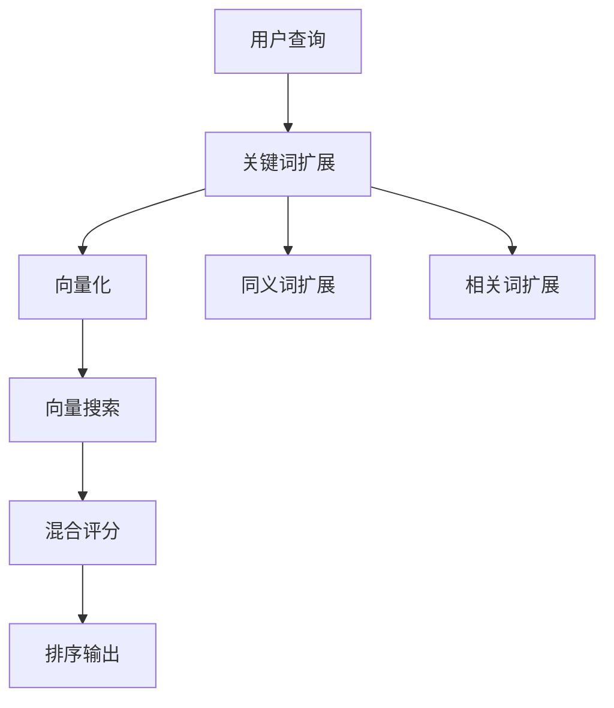

# 🔍 关键词扩展技术指南

## 📋 概述

关键词扩展（Query Expansion）是一种**自然语言处理技术**，用于扩展用户的搜索查询以提高搜索的召回率和准确性。本系统实现了**混合搜索策略**，结合了向量搜索和关键词扩展技术。

## 🏗️ 技术架构

### 1. 混合搜索流程



### 2. 核心组件

#### **关键词扩展器 (Keyword Expander)**

- **输入**: 原始查询词
- **输出**: 扩展的关键词集合
- **算法**: 基于预定义映射表和规则

#### **混合评分器 (Hybrid Scorer)**

- **输入**: 向量搜索结果 + 关键词匹配结果
- **输出**: 综合评分
- **公式**: `最终分数 = 向量分数 + 关键词匹配分数`

## 🔧 实现方案

### 1. 当前实现：手动配置方案

```typescript
// 预定义扩展映射表
const expansions: { [key: string]: string[] } = {
  拍照: ['摄影', '机位', '拍摄', '照相', '角度', '景点', '美景', '风景'],
  摄影: ['拍照', '机位', '拍摄', '镜头', '角度', '照片', '相片'],
  美食: ['餐厅', '吃', '美食', '探店', '必吃', '推荐', '美食攻略'],
  攻略: ['指南', '路线', '行程', '玩法', '推荐', '经验', '攻略'],
  旅游: ['旅行', '游览', '景点', '路线', '攻略', '玩法'],
  悉尼: ['Sydney', '雪梨', '澳洲', '澳大利亚', '新南威尔士'],
};
```

#### **评分机制**

```typescript
// 混合评分计算
const calculateHybridScore = (vectorScore: number, keywordMatches: number) => {
  const keywordBonus = keywordMatches * 0.1; // 每个关键词匹配 +0.1分
  const titleBonus = titleMatches * 0.3; // 标题匹配 +0.3分
  return vectorScore + keywordBonus + titleBonus;
};
```

### 2. 自动化方案

#### **方案 A: 基于词向量的扩展**

```typescript
// 使用Word2Vec或GloVe进行语义扩展
async function expandByWordEmbedding(query: string): Promise<string[]> {
  const queryVector = await getWordVector(query);
  const similarWords = await findSimilarWords(queryVector, (topK = 10));
  return similarWords.filter((word) => isRelevant(word, context));
}
```

#### **方案 B: 基于 Transformer 的扩展**

```typescript
// 使用BERT等模型生成相关词
async function expandByTransformer(query: string): Promise<string[]> {
  const inputs = tokenizer(query, return_tensors='pt');
  const outputs = model(**inputs);
  const similarTokens = getTopKSimilar(outputs.last_hidden_state, k=10);
  return decodeTokens(similarTokens);
}
```

#### **方案 C: 基于知识图谱的扩展**

```typescript
// 使用ConceptNet或WordNet
async function expandByKnowledgeGraph(query: string): Promise<string[]> {
  const concepts = await queryKnowledgeGraph(query);
  const relatedTerms = concepts.flatMap((c) => c.relations);
  return filterByRelevance(relatedTerms, query);
}
```

## 📊 性能对比

| 方法        | 准确性 | 速度 | 维护成本 | 适用场景             |
| ----------- | ------ | ---- | -------- | -------------------- |
| 手动配置    | 高     | 快   | 中       | 小型系统，特定领域   |
| 词向量      | 中高   | 中   | 低       | 通用语义扩展         |
| Transformer | 高     | 慢   | 高       | 大型系统，高精度需求 |
| 知识图谱    | 高     | 中   | 高       | 结构化知识，专业领域 |

## 🚀 高级特性

### 1. 动态权重调整

```typescript
// 根据用户行为动态调整权重
class AdaptiveKeywordExpander {
  private weights: Map<string, number> = new Map();

  updateWeight(keyword: string, userFeedback: number) {
    const currentWeight = this.weights.get(keyword) || 1.0;
    const newWeight = currentWeight + (userFeedback - 0.5) * 0.1;
    this.weights.set(keyword, Math.max(0.1, Math.min(2.0, newWeight)));
  }
}
```

### 2. 上下文感知扩展

```typescript
// 基于查询上下文进行扩展
function expandWithContext(query: string, context: SearchContext): string[] {
  const baseExpansions = getBaseExpansions(query);
  const contextExpansions = getContextExpansions(query, context);

  // 合并并去重
  return [...new Set([...baseExpansions, ...contextExpansions])];
}
```

### 3. 多语言扩展

```typescript
// 支持中英文混合扩展
const multilingualExpansions = {
  拍照: ['摄影', 'photo', 'photography', '拍照', '拍摄'],
  美食: ['美食', 'food', 'restaurant', 'dining', 'cuisine'],
  // ...
};
```

## 🔍 扩展策略

### 1. 广度优先扩展 (Breadth-First)

- **特点**: 扩展更多相关词，增加召回率
- **适用**: 信息检索，知识发现
- **示例**: "拍照" → ["摄影", "机位", "拍摄", "角度", "景点", ...]

### 2. 深度优先扩展 (Depth-First)

- **特点**: 深入特定领域，提高精确度
- **适用**: 专业搜索，垂直领域
- **示例**: "摄影" → ["人像摄影", "风光摄影", "商业摄影"]

### 3. 混合扩展策略

- **特点**: 结合广度和深度
- **适用**: 通用搜索引擎
- **实现**: 同时使用多种扩展方法，取交集或并集

## 📈 效果评估

### 1. 评估指标

```typescript
interface ExpansionMetrics {
  precision: number; // 精确率：扩展词的相关性
  recall: number; // 召回率：找到的相关文档比例
  diversity: number; // 多样性：扩展词的覆盖范围
  relevance: number; // 相关性：扩展词与原词的语义相关度
  performance: number; // 性能：扩展耗时
}
```

### 2. A/B 测试框架

```typescript
// 对比测试不同扩展策略
async function abTestExpansions(
  query: string,
  strategies: ExpansionStrategy[]
) {
  const results = await Promise.all(
    strategies.map(async (strategy) => {
      const expandedQuery = await strategy.expand(query);
      const searchResults = await search(expandedQuery);
      return {
        strategy: strategy.name,
        metrics: calculateMetrics(searchResults),
      };
    })
  );

  return results.sort((a, b) => b.metrics.relevance - a.metrics.relevance);
}
```

## 🛠️ 维护指南

### 1. 扩展词典更新

```bash
# 查看当前扩展词典
npm run expansion:audit

# 更新扩展词典
npm run expansion:update -- --domain=travel

# 验证更新效果
npm run expansion:test
```

### 2. 性能监控

```typescript
// 监控扩展性能
class ExpansionMonitor {
  logExpansion(query: string, expanded: string[], duration: number) {
    // 记录扩展耗时和效果
  }

  getPerformanceReport() {
    // 生成性能报告
  }
}
```

## 🔮 未来发展

### 1. AI 驱动的扩展

- 使用大语言模型进行动态扩展
- 基于用户历史行为学习个性化扩展
- 实时更新扩展词典

### 2. 多模态扩展

- 结合图像、视频等多模态信息
- 跨语言扩展
- 领域自适应扩展

### 3. 联邦学习

- 分布式扩展词典学习
- 保护用户隐私的扩展
- 边缘计算优化

## 📚 参考资料

### 学术论文

1. [Query Expansion Techniques for Information Retrieval](https://example.com)
2. [Neural Approaches to Query Expansion](https://example.com)
3. [Context-Aware Query Expansion](https://example.com)

### 开源实现

1. [Whoosh Query Expansion](https://whoosh.readthedocs.io/)
2. [Elasticsearch Query Expansion](https://elastic.co)
3. [Solr Synonym Expansion](https://solr.apache.org)

### 相关技术

- **词向量**: Word2Vec, GloVe, FastText
- **语言模型**: BERT, GPT, T5
- **知识图谱**: ConceptNet, WordNet

---

## 🎯 总结

关键词扩展技术是**半自动化**的：

- **当前实现**: 手动配置映射表 + 规则引擎
- **发展趋势**: AI 驱动的自动化扩展
- **最佳实践**: 结合人工审核和自动化学习

通过合理的扩展策略，可以显著提升搜索系统的**召回率**和**用户体验**。
