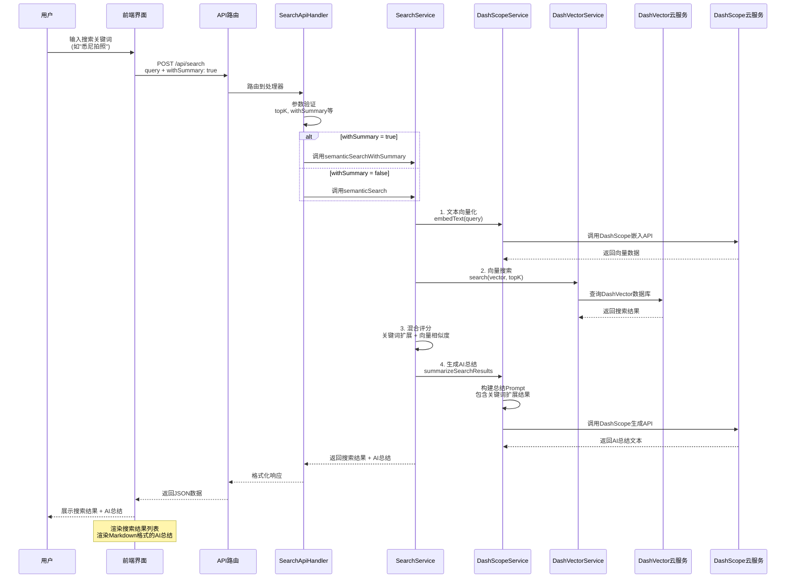
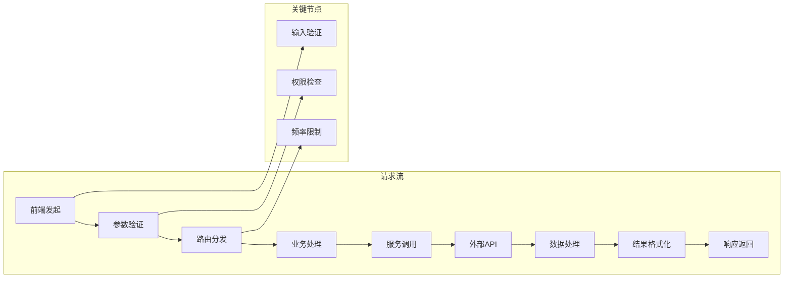

# 🏗️ 小红书 AI 搜索系统架构图

## 📋 系统概述

这是一个基于向量搜索和 AI 总结的小红书内容搜索系统，集成了多层智能处理技术。

```mermaid
graph TB
    %% 用户层
    subgraph "用户界面层"
        UI[前端界面<br/>React + Next.js]
        SearchForm[搜索表单]
        ResultsList[搜索结果列表]
        AISummary[AI总结展示]
    end

    %% API层
    subgraph "API服务层"
        API[Next.js API Routes<br/>/api/search]
        Handler[SearchApiHandler<br/>业务逻辑处理]
        Validation[参数验证<br/>topK, withSummary等]
    end

    %% 核心服务层
    subgraph "核心服务层"
        SearchService[SearchService<br/>搜索业务逻辑]
        DashScopeService[DashScopeService<br/>AI文本处理]
        DashVectorService[DashVectorService<br/>向量搜索]
    end

    %% 外部服务层
    subgraph "外部服务层"
        DashScope[DashScope API<br/>文本嵌入 & 生成]
        DashVector[DashVector<br/>向量数据库]
        MongoDB[(MongoDB<br/>原始数据存储)]
    end

    %% 数据流
    UI --> API
    API --> Handler
    Handler --> Validation
    Validation --> SearchService

    SearchService --> DashScopeService
    SearchService --> DashVectorService

    DashScopeService --> DashScope
    DashVectorService --> DashVector

    %% 条件分支
    Handler -->{withSummary?} SearchService
    SearchService -->{普通搜索} DashVectorService
    SearchService -->{带总结} DashScopeService

    %% 结果返回
    SearchService --> Handler
    Handler --> API
    API --> UI

    %% 样式定义
    classDef userLayer fill:#e1f5fe,stroke:#01579b
    classDef apiLayer fill:#f3e5f5,stroke:#4a148c
    classDef serviceLayer fill:#e8f5e8,stroke:#1b5e20
    classDef externalLayer fill:#fff3e0,stroke:#e65100

    class UI,SearchForm,ResultsList,AISummary userLayer
    class API,Handler,Validation apiLayer
    class SearchService,DashScopeService,DashVectorService serviceLayer
    class DashScope,DashVector,MongoDB externalLayer
```

## 🔄 详细流程图

### 完整搜索流程（带 AI 总结）



### 关键词扩展流程

```mermaid
graph TD
    A[用户查询<br/>如"拍照"] --> B{是否在<br/>手动词典中?}

    B -->|是| C[获取手动扩展词<br/>摄影、机位、拍摄...]
    B -->|否| D[尝试形态学扩展<br/>基于词根规则]
    B -->|否| E[尝试统计学习<br/>基于历史数据]

    C --> F[合并所有扩展词]
    D --> F
    E --> F

    F --> G[去重处理]
    G --> H[置信度计算]
    H --> I[返回扩展结果<br/>+ 置信度分数]

    %% 学习反馈
    I --> J[记录用户行为]
    J --> K[更新学习模式]
    K --> L[持续优化词典]

    %% 样式定义
    classDef process fill:#e3f2fd,stroke:#1976d2
    classDef decision fill:#fff3e0,stroke:#f57c00
    classDef output fill:#e8f5e8,stroke:#2e7d32
    classDef learning fill:#fce4ec,stroke:#c2185b

    class A,B,C,D,E,F,G,H,I process
    class decision
    class J,K,L learning
```

## 🗂️ 系统组件说明

### 1. 前端界面层 (Frontend Layer)

#### **主要组件**

- **SearchForm**: 搜索输入表单
- **SearchResults**: 搜索结果展示
- **AISummary**: AI 总结渲染（支持 Markdown）

#### **技术栈**

- React 18 + TypeScript
- Next.js 14 (App Router)
- Tailwind CSS + shadcn/ui
- React Markdown + remark-gfm

### 2. API 服务层 (API Layer)

#### **核心处理器**

- **SearchApiHandler**: 继承自 BaseApiHandler
- **参数验证**: topK (1-100), withSummary, customPrompt 等
- **错误处理**: 统一的异常处理机制

#### **路由结构**

```
POST /api/search
├── query: string (required)
├── topK: number (optional, default: 5)
├── withSummary: boolean (optional)
├── customPrompt: string (optional)
└── summaryOptions: object (optional)
```

### 3. 核心服务层 (Service Layer)

#### **SearchService**

- **semanticSearch()**: 普通向量搜索
- **semanticSearchWithSummary()**: 带 AI 总结的搜索
- **hybridSearch()**: 混合搜索（向量 + 关键词）
- **expandQueryKeywords()**: 关键词扩展

#### **DashScopeService**

- **embedText()**: 文本向量化
- **generateText()**: AI 文本生成
- **summarizeSearchResults()**: 智能总结

#### **DashVectorService**

- **search()**: 向量相似度搜索
- **initCollection()**: 集合初始化
- **dropCollection()**: 集合清理

### 4. 外部服务层 (External Services)

#### **DashScope (Alibaba Cloud)**

- **文本嵌入**: text-embedding-v2 模型
- **文本生成**: qwen-turbo 模型
- **API 调用**: HTTP RESTful 接口

#### **DashVector (Alibaba Cloud)**

- **向量存储**: 高性能向量数据库
- **相似度搜索**: 余弦相似度算法
- **集合管理**: 动态集合创建和管理

#### **MongoDB**

- **原始数据存储**: 用户笔记原始数据
- **数据同步**: 与向量数据库保持同步
- **备份恢复**: 数据持久化保障

## 🔄 数据流程

### 搜索请求流程



### AI 总结生成流程

```mermaid
graph TD
    A[搜索结果] --> B[内容筛选<br/>关键词相关性]
    B --> C[Prompt构建<br/>包含上下文]
    C --> D[AI模型调用<br/>DashScope API]
    D --> E[文本生成<br/>qwen-turbo]
    E --> F[格式处理<br/>Markdown渲染]
    F --> G[质量检查]
    G --> H[最终输出]

    %% 错误处理
    D -->{失败} I[降级处理<br/>使用模板]
    E -->{失败} J[重试机制]
    G -->{质量不佳} K[重新生成]
```

## 📊 性能监控

### 关键指标

| 指标           | 目标值  | 监控点          |
| -------------- | ------- | --------------- |
| 搜索响应时间   | < 2 秒  | 前端到 API      |
| 向量搜索时间   | < 500ms | DashVector 查询 |
| AI 总结时间    | < 3 秒  | DashScope 生成  |
| 关键词扩展时间 | < 50ms  | 本地处理        |

### 监控架构

```mermaid
graph TB
    subgraph "应用监控"
        A[前端性能]<br/>页面加载时间
        B[API性能]<br/>响应时间分布
        C[服务性能]<br/>各模块耗时
    end

    subgraph "外部监控"
        D[DashScope]<br/>API调用状态
        E[DashVector]<br/>查询性能
        F[MongoDB]<br/>连接状态
    end

    subgraph "业务监控"
        G[搜索成功率]
        H[AI总结质量]
        I[用户满意度]
    end

    A --> J[监控面板]
    B --> J
    C --> J
    D --> J
    E --> J
    F --> J
    G --> J
    H --> J
    I --> J
```

## 🚀 扩展计划

### 短期优化 (1-2 周)

- [ ] 缓存机制优化
- [ ] 并发请求处理
- [ ] 错误重试机制

### 中期功能 (1 个月)

- [ ] 个性化搜索推荐
- [ ] 多语言支持
- [ ] 高级筛选条件

### 长期规划 (3 个月)

- [ ] 联邦学习集成
- [ ] 实时索引更新
- [ ] 跨模态搜索

---

## 🎯 使用指南

### 基本搜索

```bash
curl -X POST http://localhost:3000/api/search \
  -H "Content-Type: application/json" \
  -d '{"query": "悉尼旅游", "topK": 10}'
```

### AI 总结搜索

```bash
curl -X POST http://localhost:3000/api/search \
  -H "Content-Type: application/json" \
  -d '{"query": "悉尼美食", "topK": 20, "withSummary": true}'
```

### 自定义 Prompt

```bash
curl -X POST http://localhost:3000/api/search \
  -H "Content-Type: application/json" \
  -d '{
    "query": "悉尼攻略",
    "withSummary": true,
    "customPrompt": "请从预算角度分析..."
  }'
```

---

_最后更新时间: 2024 年当前时间_
_系统版本: v1.0.0_
