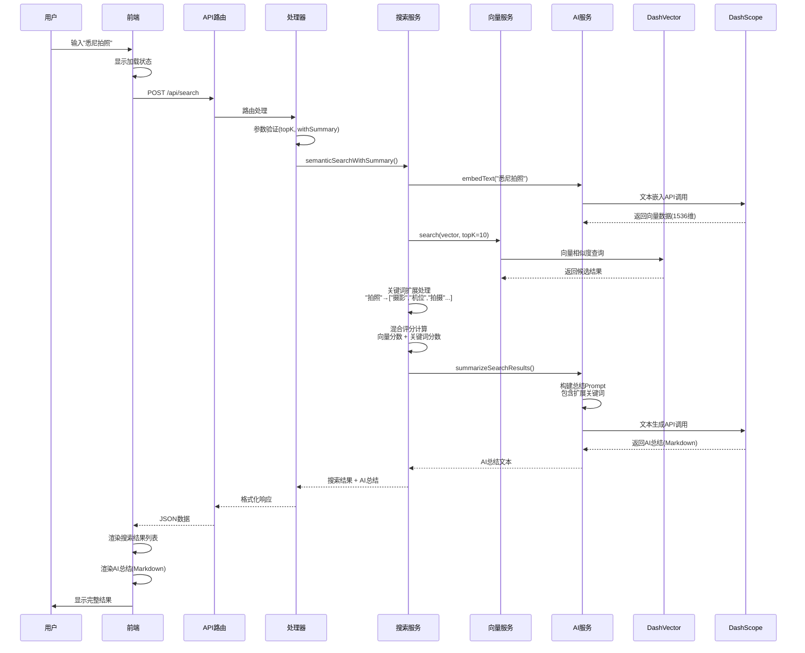
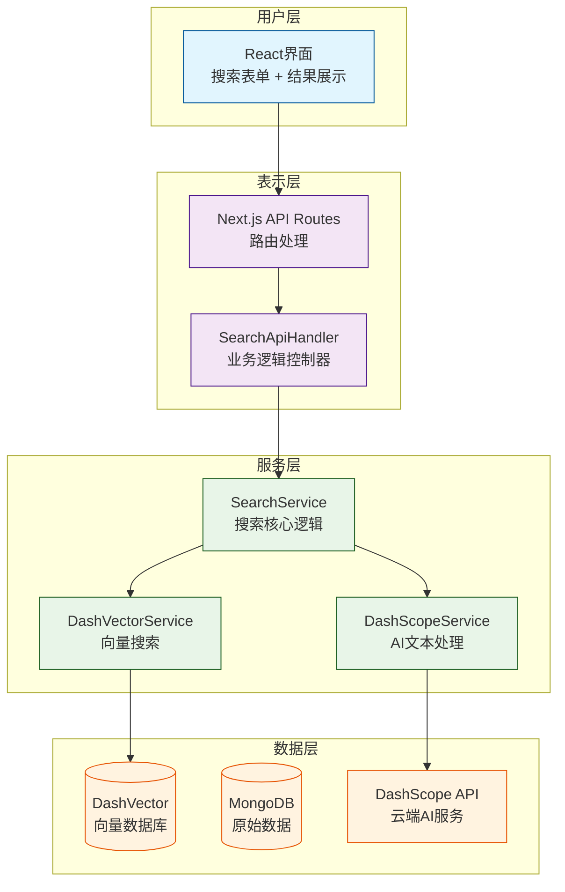
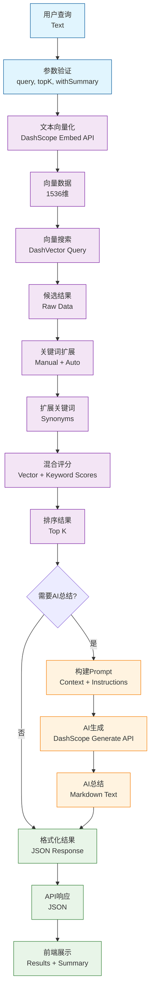
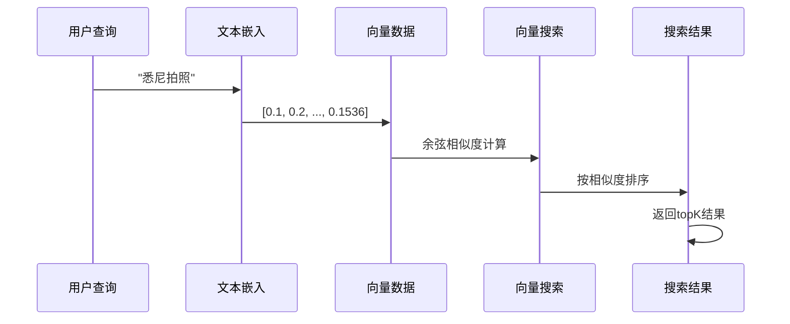
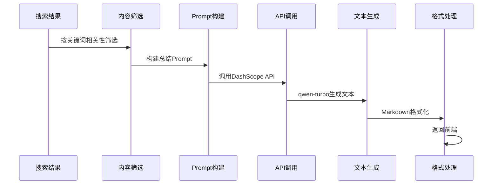
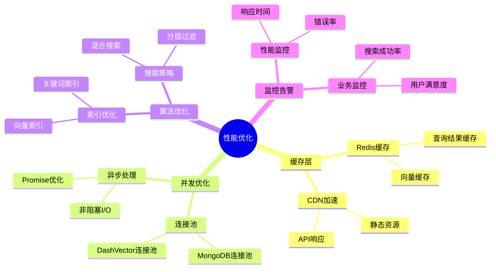

# 🔄 小红书 AI 搜索系统流程图

## 📋 核心流程总览

```mermaid
flowchart TD
    %% 用户输入
    A[用户输入查询<br/>如"悉尼拍照"] --> B[前端表单提交]

    %% 前端处理
    B --> C[React界面<br/>显示加载状态]

    %% API层
    C --> D[Next.js API<br/>/api/search]
    D --> E[SearchApiHandler<br/>参数验证]

    %% 分支判断
    E --> F{是否需要AI总结?}
    F -->|是| G[semanticSearchWithSummary]
    F -->|否| H[semanticSearch]

    %% 核心搜索流程
    G --> I[文本向量化<br/>DashScope API]
    H --> I
    I --> J[向量搜索<br/>DashVector数据库]
    J --> K[关键词扩展<br/>混合评分]

    %% AI总结分支
    K --> L{AI总结?}
    L -->|是| M[构建总结Prompt]
    L -->|否| N[格式化搜索结果]

    M --> O[调用AI生成<br/>DashScope qwen-turbo]
    O --> P[Markdown格式化]
    P --> N

    %% 返回结果
    N --> Q[JSON响应]
    Q --> R[前端渲染]
    R --> S[显示搜索结果]
    R --> T[显示AI总结]

    %% 样式定义
    classDef frontend fill:#e3f2fd,stroke:#1976d2,stroke-width:2px
    classDef backend fill:#f3e5f5,stroke:#7b1fa2,stroke-width:2px
    classDef service fill:#e8f5e8,stroke:#388e3c,stroke-width:2px
    classDef ai fill:#fff3e0,stroke:#f57c00,stroke-width:2px
    classDef result fill:#fce4ec,stroke:#c2185b,stroke-width:2px

    class A,B,C frontend
    class D,E,F,G,H backend
    class I,J,K service
    class L,M,O,P ai
    class N,Q,R,S,T result
```

## 🔄 详细交互流程

### 时序图 - 完整搜索过程



## 🏗️ 系统架构分层



## 🔄 核心算法流程

### 混合搜索算法

```mermaid
graph TD
    A[用户查询<br/>"悉尼拍照"] --> B[向量化<br/>1536维向量]

    B --> C[向量搜索<br/>DashVector]
    C --> D[获取候选结果<br/>topK*3]

    D --> E[关键词扩展]
    E --> F[计算混合分数<br/>向量分 + 关键词分]

    F --> G[排序筛选<br/>前topK结果]

    %% 详细扩展
    E --> E1["拍照" → "摄影"]
    E --> E2["拍照" → "机位"]
    E --> E3["拍照" → "拍摄"]

    %% 样式
    classDef process fill:#e3f2fd,stroke:#1976d2
    classDef expand fill:#fff3e0,stroke:#f57c00
    classDef score fill:#e8f5e8,stroke:#2e7d32

    class A,B,C,D,G process
    class E,E1,E2,E3 expand
    class F score
```

### AI 总结生成流程

```mermaid
graph TD
    A[搜索结果] --> B[关键词相关性筛选]
    B --> C[构建总结Prompt]

    C --> D[添加查询关键词<br/>🎯 搜索关键词：悉尼拍照]
    D --> E[添加分析要求<br/>📋 分析要求：关键词相关性优先]
    E --> F[添加搜索结果<br/>搜索结果：[...]]

    F --> G[调用DashScope API<br/>qwen-turbo模型]
    G --> H[生成Markdown总结]
    H --> I[返回前端渲染]

    %% 样式
    classDef input fill:#e3f2fd,stroke:#1976d2
    classDef process fill:#fff3e0,stroke:#f57c00
    classDef api fill:#e8f5e8,stroke:#2e7d32
    classDef output fill:#fce4ec,stroke:#c2185b

    class A,B input
    class C,D,E,F process
    class G,H api
    class I output
```

## 📊 数据流向图



## 🔄 关键技术流程

### 1. 向量搜索流程



### 2. 关键词扩展流程

```mermaid
graph LR
    A[原始查询<br/>"拍照"] --> B{在词典中?}

    B -->|是| C[获取扩展词<br/>["摄影","机位","拍摄"]]
    B -->|否| D[形态学扩展<br/>基于词根规则]

    C --> E[合并去重]
    D --> E

    E --> F[置信度评估<br/>manual: 1.0<br/>morphology: 0.8]

    F --> G[返回扩展结果<br/>+ 置信度分数]
```

### 3. AI 总结流程



## 🎯 性能优化点



---

## 📝 使用示例

### 普通搜索

```javascript
// 前端调用
fetch('/api/search', {
  method: 'POST',
  headers: { 'Content-Type': 'application/json' },
  body: JSON.stringify({
    query: '悉尼旅游',
    topK: 10,
  }),
});
```

### AI 总结搜索

```javascript
// 前端调用
fetch('/api/search', {
  method: 'POST',
  headers: { 'Content-Type': 'application/json' },
  body: JSON.stringify({
    query: '悉尼美食',
    topK: 20,
    withSummary: true,
  }),
});
```

---

_该流程图展示了小红书 AI 搜索系统的完整工作流程，从用户输入到最终结果展示的每一个环节。_
