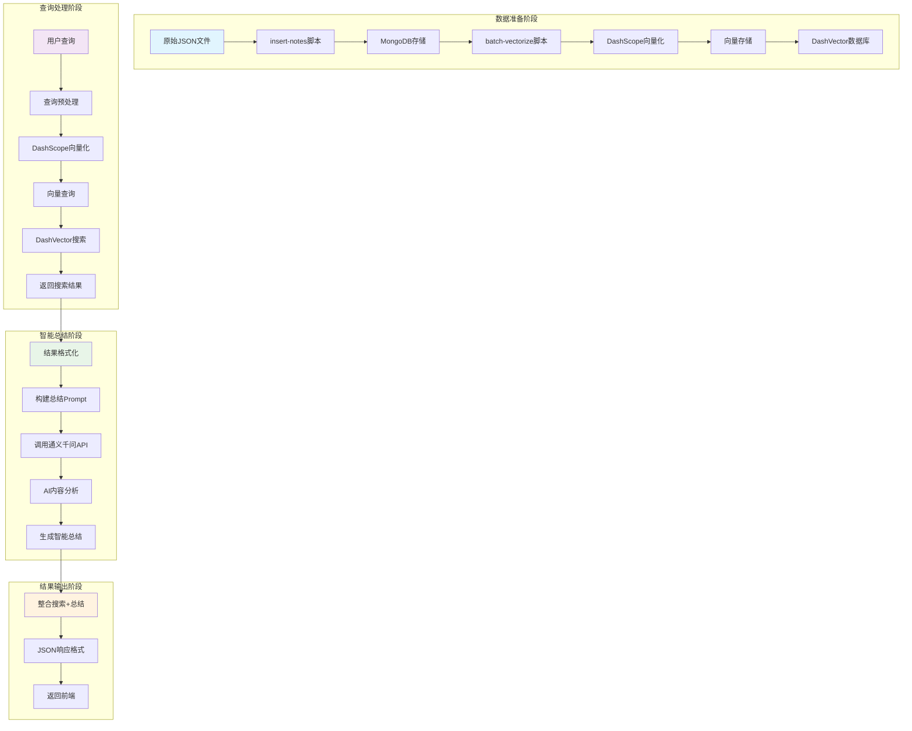
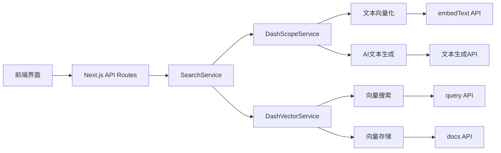
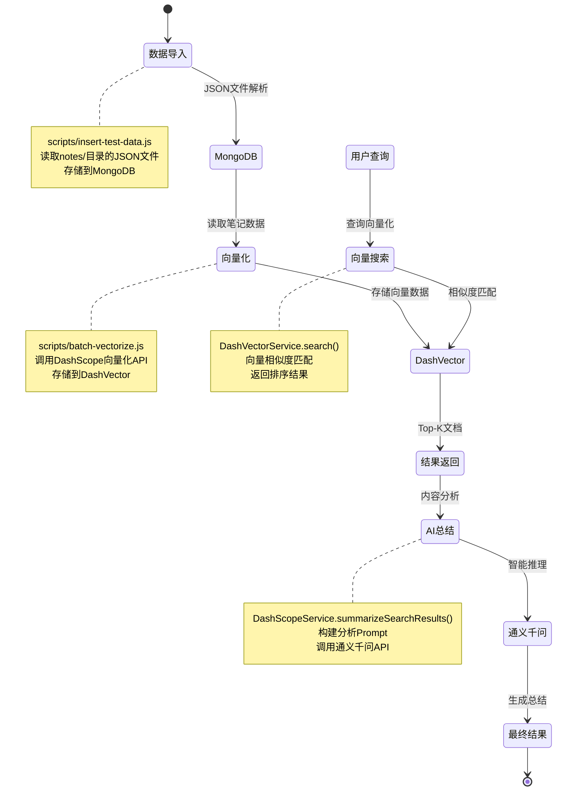

# 小红书 AI 搜索系统完整流程图

## 📊 系统架构概览



## 🔄 详细流程图

```mermaid
flowchart TD
    %% 数据导入阶段
    A[开始] --> B{数据准备}
    B --> C[读取notes/目录JSON文件]
    C --> D[解析JSON数据结构]
    D --> E[数据清洗和格式化]
    E --> F[插入MongoDB数据库]

    %% 向量化阶段
    F --> G{向量化处理}
    G --> H[连接MongoDB]
    H --> I[批量读取笔记数据]
    I --> J[提取标题+内容文本]
    J --> K[调用DashScope embedText API]
    K --> L[生成1536维向量]
    L --> M[准备向量文档格式]
    M --> N[插入DashVector数据库]
    N --> O[更新向量索引]

    %% 查询处理阶段
    O --> P{用户查询}
    P --> Q[接收查询字符串]
    Q --> R[查询预处理]
    R --> S[调用DashScope embedText API]
    S --> T[生成查询向量]
    T --> U[向量相似度搜索]
    U --> V[Top-K结果排序]
    V --> W[返回搜索结果]

    %% AI总结阶段
    W --> X{AI总结处理}
    X --> Y[提取搜索结果内容]
    Y --> Z[构建总结Prompt模板]
    Z --> AA[调用通义千问文本生成API]
    AA --> BB[AI分析和推理]
    BB --> CC[生成自然语言总结]
    CC --> DD[格式化总结结果]

    %% 响应阶段
    DD --> EE[整合搜索+总结数据]
    EE --> FF[构建JSON响应]
    FF --> GG[返回前端应用]
    GG --> HH[结束]

    %% 样式定义
    classDef dataPrep fill:#e3f2fd,stroke:#1976d2,stroke-width:2px
    classDef vectorize fill:#f3e5f5,stroke:#7b1fa2,stroke-width:2px
    classDef search fill:#e8f5e8,stroke:#388e3c,stroke-width:2px
    classDef ai fill:#fff3e0,stroke:#f57c00,stroke-width:2px
    classDef response fill:#fce4ec,stroke:#c2185b,stroke-width:2px

    class B,C,D,E,F dataPrep
    class G,H,I,J,K,L,M,N,O vectorize
    class P,Q,R,S,T,U,V,W search
    class X,Y,Z,AA,BB,CC,DD ai
    class EE,FF,GG,HH response
```



## 📋 核心组件说明

### 1. 数据存储层

- **MongoDB**: 存储原始笔记数据（标题、内容、作者、标签、URL 等）
- **DashVector**: 存储向量化的笔记数据，用于语义搜索

### 2. AI 服务层

- **DashScope Embeddings**: 将文本转换为向量（text-embedding-v2 模型）
- **通义千问**: 进行智能内容分析和总结（qwen-turbo 模型）

### 3. API 接口层

- **基础搜索**: `/api/search` - 向量相似度搜索
- **智能总结**: `/api/search/summary` - 搜索+AI 总结

## 🔧 技术栈详情



## 📊 数据流向图



## 🚀 完整使用流程

### 1. 系统初始化

```bash
# 1. 导入数据到MongoDB
npm run insert-notes

# 2. 向量化并存储到DashVector
npm run batch-vectorize

# 3. 启动前端服务
npm run frontend:dev
```

### 2. 用户查询流程

```bash
# 基础搜索
curl -X POST http://localhost:3000/api/search \
  -H "Content-Type: application/json" \
  -d '{"query": "悉尼旅游攻略", "topK": 5}'

# 智能搜索+总结
curl -X POST http://localhost:3000/api/search/summary \
  -H "Content-Type: application/json" \
  -d '{"query": "悉尼旅游攻略", "topK": 3}'
```

### 3. 内部处理流程

1. **查询预处理** → 2. **文本向量化** → 3. **向量搜索** → 4. **AI 总结** → 5. **结果返回**

这个流程图完整展示了从数据准备到智能搜索的整个系统架构！🎯
